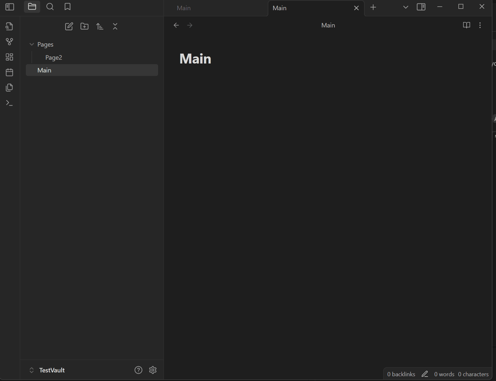

# Auto Linker for Obsidian 
> ***Currently in Development*** 

Auto linker creates links across your entire vault as you type. Links head to :
- Markdown Files
- Headers
- Tags

Its toggled with either

`Ctrl` + `Shift` + `L`

`Ctrl`+`Alt`+`L`

### In The Works
- Linker cannot yet create links from multiple words (e.g # Auto Linker). This will be changed to include full headers and words
- Setting option to remove colliding links.
- A settings allow options for only linking Tags/Headers/PageNames

### Known bugs
 - When selecting a link from a list, it removes the whole line.
 - Pages sometimes create two links, requiring a selection.
 - Old links are not removed when updated
 

### Installation 
Clone the repo or download the .zip and these files into a folder names `auto_linker`
- `main.js`
- `manifest.json`
- `styles.css`

---

Check out some of my other Obsidian/Markdown Projects!
- [Obsidian Notes Rewview Tracker](https://github.com/ThomasChambers15243/Obsidian-Review-Tracker)
- [Markdown Review Tracker in Rust](https://github.com/ThomasChambers15243/Review-Tracker)

If you want to fuel my *mild* caffeine addiction
[Buy me a Coffee :)](https://www.buymeacoffee.com/TomChambers)
